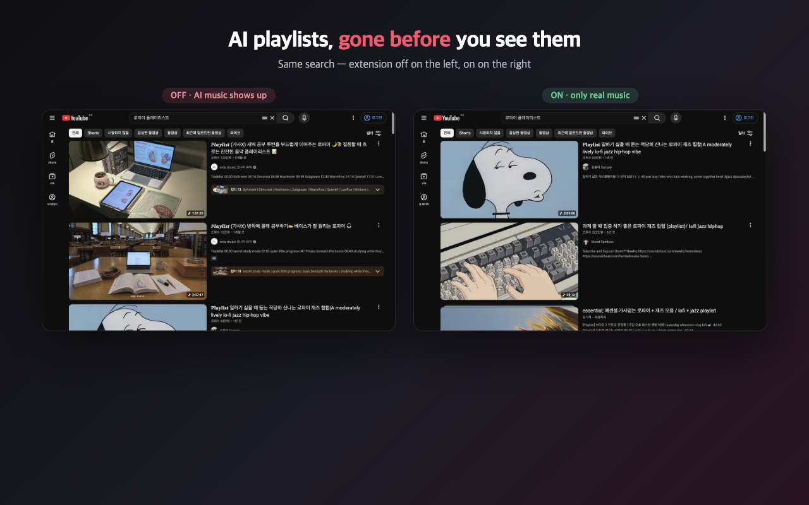
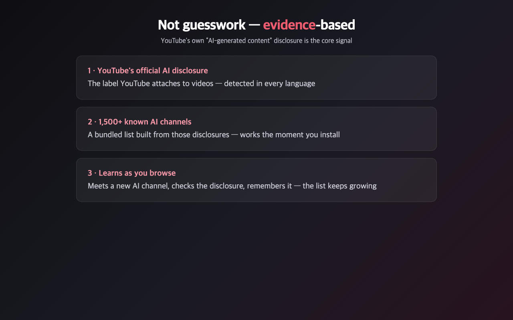
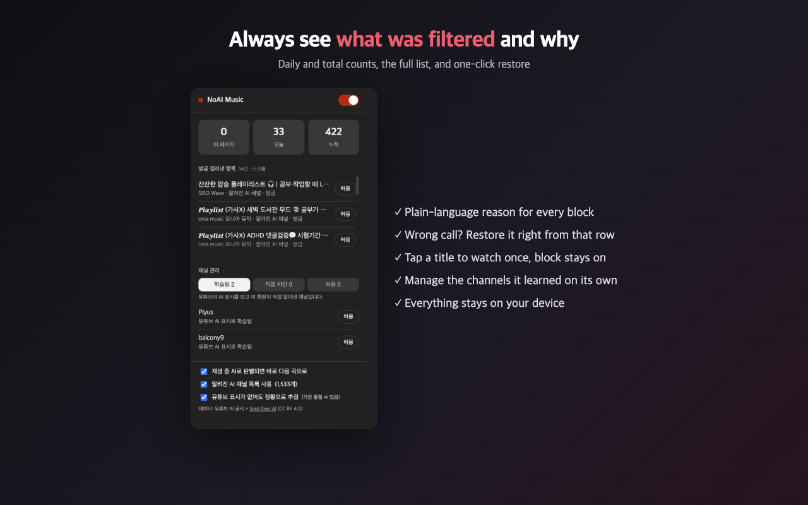

# NoAI Music

A Chrome extension that filters **AI-generated music** out of YouTube's
recommendations, search results, and autoplay queue. Regular videos are left alone.

[Install from the Chrome Web Store](https://chromewebstore.google.com/detail/enicfcdennkdfinplgflgahcicpkgoam)
· [한국어 README](README.ko.md)

Free, no account, no analytics, no external servers. The only network traffic is to
youtube.com itself.




## Why

YouTube's music search is increasingly filled with channels that upload dozens of
AI-generated "1 hour of relaxing piano" playlists a week. YouTube *does* label some of
them — but the label is buried in the description and does nothing to your feed. This
extension acts on that label, and on a few signals YouTube doesn't give you.

## How detection works

Five layers, evaluated in order. The first match wins.

1. **Allowlist** — channels you rescued are always shown.
2. **Blocklist + bundled seed list** — channels you blocked, plus 1,533 channels already
   known to publish AI music. Auto-generated "Mix" playlists from those channels are
   caught too (mixes carry no channel ID, so they're matched by name).
3. **YouTube's own AI disclosure** — both the badge next to the video title and the
   "How this content was made" section in the description. Detection is icon-based, not
   text-based, so it works in every locale (AI / IA / KI / ИИ / एआई / …).
4. **Multilingual keywords** in titles and channel names, with negation handling
   ("no AI", "AI 아님", "not made with AI" are *not* matches).
5. **A statistical fingerprint**, off-switchable — see below.

If an AI track somehow starts playing anyway, the extension skips to the next real video
within a few seconds and shows an undo toast.

### The statistical fingerprint

Validated on **772 hand-labeled music channels** (455 AI / 317 non-AI after
decontamination):

| Signal | Detection | False positives |
|---|---|---|
| views < 3,000 **and** ≥ 12 hashtags | 23% | **0.6%** (95% CI upper bound 2.3%) |
| ≥ 12 hashtags alone | higher | 6.9% — rejected |
| views alone | higher | 30% — rejected |

The principle: AI channels mass-produce, but nobody listens (median 1,206 views vs
240,000 for human channels). Low view count on its own would punish new creators, so it
only counts when hashtag spam appears with it. This layer can be turned off in the popup.



### Why channel-level checking

Channels disclose inconsistently. One measured channel had the AI disclosure on only 4 of
its 8 most recent videos. So when a video looks clean, the extension checks a few more
videos from the same channel (via the channel's public RSS feed) before caching a
"not AI" verdict. A network failure is never cached as "not AI" — that bug was written
twice during development and is now guarded by tests.



## Architecture

- **MAIN world** (`src/page.js`) traps `window.ytInitialData` with a property setter and
  wraps `window.fetch` for `/youtubei/v1/{next,browse,search}`. Filtering happens in the
  data layer **before YouTube renders**, which is why autoplay never stutters — the
  autoplay target is rewritten to the first surviving video.
- **ISOLATED world** (`src/content.js`) owns storage, the DOM safety net, channel
  profiling, and the skip/undo UI.
- Every hook is wrapped in try/catch and passes the original data through on failure.
  **Breaking YouTube is worse than missing a filter.**
- `src/heuristics.js` is pure and dependency-free, so the detection core is testable
  without a browser. (`heuristics.iso.js` is a byte-identical copy — Chrome will not
  inject the same file path into two worlds, a limitation an equality test guards.)

Permissions: `storage` and `https://www.youtube.com/*`. That's all.

## Development

```bash
npm test          # 88 tests, no network required
npm run build     # produces dist/noaimusic-<version>.zip from the manifest's file list
```

Load `chrome://extensions` → Developer mode → Load unpacked → this folder.

**Safari (macOS):** the same code ships as a Safari web extension wrapped in a Mac app
(`safari/`, generated by `safari-web-extension-converter`). Requires Safari 18+.
`npm run build:safari` builds and installs it to `~/Applications`; enable it in Safari
Settings › Extensions, then click the toolbar icon on youtube.com and choose
"Always Allow on This Website" — Safari does not run the extension until you do.
`npm run archive:safari` produces the Mac App Store package.

Tests cover the detection core, autoplay preservation (page.js run under `vm`), live
YouTube response fixtures, UI copy, and a security regression guard (no `eval`, no hosts
outside youtube.com, permissions unchanged, and several specific bugs that bit us once).

## Known limitations

A channel that never discloses and has normal engagement is invisible to every layer —
during testing we found one with 1.3M views that nothing catches. For those there's a
one-click "block this channel" in the popup. If you find a detection signal we're
missing, please open an issue.

## Credits

Part of the bundled channel list comes from the
[Soul Over AI](https://souloverai.com) project (CC BY 4.0), which solved the cold-start
problem for us. The rest was collected from YouTube's own AI disclosures.

## License

Code: MIT — see [LICENSE](LICENSE). Data files: CC BY 4.0 — see [LICENSE-DATA.md](LICENSE-DATA.md).

Not affiliated with YouTube or Google.
